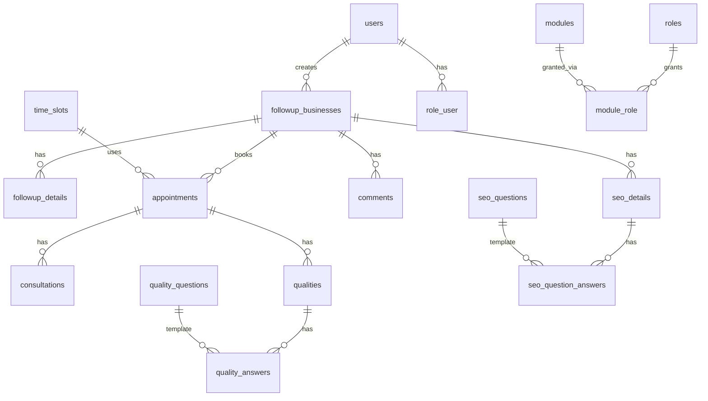

# Database structure

This document describes the relational schema for **Fastranking CRM** as defined by Laravel migrations under `database/migrations/`. It reflects the cumulative state **after all migrations run in order**.

**Source of truth:** PHP migration files (not inferred from runtime or models).

---

## Table of contents

1. [High-level domains](#high-level-domains)
2. [Framework & infrastructure](#framework--infrastructure-tables)
3. [IAM: users, teams, departments, roles, modules](#identity-access--organisation)
4. [Leads & follow-up](#leads--follow-up)
5. [Appointments & scheduling](#appointments--scheduling)
6. [Consultations](#consultations)
7. [Quality audit](#quality-audit)
8. [SEO audit](#seo-audit)
9. [Reference data](#reference-data-business-categories--types)
10. [Communications](#communications)
11. [Entity relationship overview](#entity-relationship-overview)
12. [Migration index](#migration-index)

---

## High-level domains

| Domain | Core tables |
|--------|-------------|
| Auth / sessions | `users`, `password_reset_tokens`, `sessions`, `personal_access_tokens` |
| Organisation & RBAC | `teams`, `departments`, `roles`, `modules`, pivots (`team_user`, `department_user`, `role_user`, `module_role`) |
| CRM leads | `followup_businesses`, `followup_auth_persons`, `followup_business_auth_person`, `followup_details`, `comments` |
| Scheduling | `time_slots`, `appointments`, `appointment_temporary_bookings`, `appointment_settings`, `user_block_calender` |
| Post-booking | `consultations`, `qualities`, `quality_questions`, `quality_answers` |
| SEO | `seo_questions`, `seo_details`, `seo_question_answers` |
| Reference | `business_categories`, `business_types` |
| Outbound mail log | `emails` |

---

## Framework & infrastructure tables

### `cache`

| Column | Type | Notes |
|--------|------|--------|
| `key` | string, PK | |
| `value` | mediumText | |
| `expiration` | integer, indexed | |

### `cache_locks`

| Column | Type | Notes |
|--------|------|--------|
| `key` | string, PK | |
| `owner` | string | |
| `expiration` | integer, indexed | |

### `jobs`

| Column | Type | Notes |
|--------|------|--------|
| `id` | bigIncrements | |
| `queue` | string | |
| `payload` | longText | |
| `attempts` | unsignedTinyInteger | |
| `reserved_at` | unsignedInteger, nullable | |
| `available_at` | unsignedInteger | |
| `created_at` | unsignedInteger | |

Index: `(queue, reserved_at, available_at)`.

### `job_batches`

| Column | Type | Notes |
|--------|------|--------|
| `id` | string, PK | |
| `name` | string | |
| `total_jobs`, `pending_jobs`, `failed_jobs` | integer | |
| `failed_job_ids` | longText | |
| `options` | mediumText, nullable | |
| `cancelled_at`, `created_at`, `finished_at` | integer / nullable | |

### `failed_jobs`

| Column | Type | Notes |
|--------|------|--------|
| `id` | bigIncrements | |
| `uuid` | string, unique | |
| `connection`, `queue` | text | |
| `payload`, `exception` | longText | |
| `failed_at` | timestamp | default current |

---

## Identity, access & organisation

### `users`

| Column | Type | Constraints / notes |
|--------|------|----------------------|
| `id` | bigIncrements, PK | |
| `first_name`, `last_name` | string | |
| `middle_name` | string, nullable | |
| `gender` | enum(`male`,`female`,`other`) | |
| `dob` | date | |
| `email` | string, unique, nullable | |
| `mobile` | string, unique, nullable | |
| `username` | string, unique | |
| `password` | string | hashed |
| `date_of_joining` | date | |
| `emp_id` | string, unique | |
| `status` | enum(`active`,`inactive`,`suspended`) | default `active` |
| `user_type` | enum(`admin`,`manager`,`employee`) | default `employee` |
| `designation` | string | |
| `created_by` | unsignedBigInteger, nullable | FK → `users.id`, `ON DELETE SET NULL` |
| `created_at`, `updated_at` | timestamps | |

### `password_reset_tokens`

| Column | Type |
|--------|------|
| `email` | string, PK |
| `token` | string |
| `created_at` | timestamp, nullable |

### `sessions`

| Column | Type | Notes |
|--------|------|--------|
| `id` | string, PK | |
| `user_id` | FK id, nullable, indexed | no explicit FK constraint in migration |
| `ip_address` | string(45), nullable | |
| `user_agent` | text, nullable | |
| `payload` | longText | |
| `last_activity` | integer, indexed | |

### `personal_access_tokens` (Laravel Sanctum)

| Column | Type | Notes |
|--------|------|--------|
| `id` | bigIncrements | |
| `tokenable_type`, `tokenable_id` | string, unsignedBigInteger, indexed | morph |
| `name` | text | |
| `token` | string(64), unique | |
| `abilities` | text, nullable | |
| `last_used_at` | timestamp, nullable | |
| `expires_at` | timestamp, nullable, indexed | |
| `created_at`, `updated_at` | timestamps | |

### `teams`

| Column | Type | Notes |
|--------|------|--------|
| `id` | bigIncrements | |
| `name` | string | |
| `description` | text, nullable | |
| `status` | enum(`active`,`inactive`) | default `active`, indexed |
| `created_by` | unsignedBigInteger | FK → `users.id`, `CASCADE` |
| `created_at`, `updated_at` | timestamps | |

### `departments`

Same shape as `teams` (`name`, `description`, `status`, `created_by`, timestamps).

### `roles`

Same shape as `teams` (`name`, `description`, `status`, `created_by`, timestamps).

### `modules`

Same shape as `teams` (`name`, `description`, `status`, `created_by`, timestamps).

### `team_user` (pivot)

| Column | Type | Constraints |
|--------|------|-------------|
| `id` | bigIncrements | |
| `user_id` | unsignedBigInteger | FK → `users`, `CASCADE` |
| `team_id` | unsignedBigInteger | FK → `teams`, `CASCADE` |
| Unique | `(user_id, team_id)` | |

### `department_user` (pivot)

Same pattern: `user_id`, `department_id`, unique `(user_id, department_id)`, FK cascade.

### `role_user` (pivot)

Same pattern: `user_id`, `role_id`, unique `(user_id, role_id)`, FK cascade.

### `module_role` (pivot)

| Column | Type | Constraints |
|--------|------|-------------|
| `id` | bigIncrements | |
| `role_id` | unsignedBigInteger | FK → `roles`, `CASCADE` |
| `module_id` | unsignedBigInteger | FK → `modules`, `CASCADE` |
| `can_create`, `can_read`, `can_update`, `can_delete` | boolean | default false |
| Unique | `(role_id, module_id)` | |

---

## Leads & follow-up

### `followup_businesses`

| Column | Type | Constraints / notes |
|--------|------|----------------------|
| `id` | bigIncrements | |
| `name` | string | indexed with category, type |
| `category`, `type` | string, nullable | |
| `website`, `email` | string, nullable | |
| `phone` | string, unique, nullable | |
| `created_by` | unsignedBigInteger | FK → `users`, `CASCADE` |
| `latest_followup_date`, `latest_followup_time` | date / time, nullable | Denormalized from latest row in `followup_details` (`date`/`time`), for cursor-safe list ordering; synced by `FollowupDetailObserver` + `php artisan followup:sync-latest-sort`. |
| `created_at`, `updated_at` | timestamp | MySQL defaults: `CURRENT_TIMESTAMP` / `ON UPDATE` |

### `followup_auth_persons`

| Column | Type | Constraints / notes |
|--------|------|----------------------|
| `id` | bigIncrements | |
| `title`, `middlename`, `designation` | string, nullable | |
| `firstname`, `lastname` | string | |
| `is_primary` | boolean | default false, indexed |
| `gender` | enum(`male`,`female`,`other`), nullable | |
| `dob` | date, nullable | |
| `primaryphone`, `altphone`, `primarymobile`, `altmobile` | string, unique, nullable | |
| `primaryemail` | string, unique | required in migration |
| `altemail` | string, unique, nullable | |
| `created_by` | unsignedBigInteger, nullable | FK → `users`, `SET NULL` |
| `created_at`, `updated_at` | timestamp | |

### `followup_business_auth_person` (pivot)

| Column | Type | Constraints |
|--------|------|-------------|
| `id` | bigIncrements | |
| `followup_business_id` | unsignedBigInteger | FK → `followup_businesses`, `CASCADE` |
| `followup_auth_person_id` | unsignedBigInteger | FK → `followup_auth_persons`, `CASCADE` |
| Unique | `(followup_business_id, followup_auth_person_id)` | name `fb_ap_unique` |

### `followup_details`

Business key is **string** (`FRID…` format, 12 chars per migration).

| Column | Type | Constraints |
|--------|------|-------------|
| `id` | string(12), PK | |
| `followup_business_id` | unsignedBigInteger | FK → `followup_businesses`, `CASCADE` |
| `source`, `status` | string, nullable | |
| `date` | date, nullable | |
| `time` | time, nullable | |
| `created_by` | unsignedBigInteger, nullable | FK → `users`, `SET NULL` |
| Index | `(followup_business_id, status, date)` | |

### `comments`

| Column | Type | Constraints |
|--------|------|-------------|
| `id` | bigIncrements | |
| `followup_business_id` | unsignedBigInteger | FK → `followup_businesses`, `CASCADE` |
| `comment` | text | |
| `old_status`, `new_status` | string, nullable | |
| `created_by` | unsignedBigInteger, nullable | FK → `users`, `SET NULL` |
| Index | `(followup_business_id, created_at)` | |

---

## Appointments & scheduling

### `time_slots`

| Column | Type | Notes |
|--------|------|--------|
| `id` | bigIncrements | |
| `name` | string(100) | |
| `start_time`, `end_time` | time | |
| `duration_minutes` | integer | |
| `is_active` | boolean | default true |
| `max_concurrent_bookings` | integer | default 3 |
| `description` | text, nullable | |
| `department_ids` | json, nullable | department ids allowed for slot |
| `created_at`, `updated_at` | timestamps | |

Index: `(is_active, start_time)`.

### `appointments`

Primary key is **string** (`FRMID…`; length increased by later migration).

| Column | Type | Constraints / notes |
|--------|------|----------------------|
| `id` | string(**15**), PK | **Final length** after `2026_03_16_120000_fix_appointments_id_length` |
| `followup_business_id` | unsignedBigInteger | FK → `followup_businesses`, `CASCADE` |
| `source` | string(255), nullable | |
| `status` | enum(`Appointment Booked`,`Appointment Rebooked`) | default `Appointment Booked` |
| `date` | date | |
| `time_slot_id` | unsignedBigInteger | FK → `time_slots`, `RESTRICT` |
| `current_status` | string(100), nullable | indexed |
| `created_by` | unsignedBigInteger, nullable | FK → `users`, `SET NULL` |
| Unique | `(followup_business_id, date, time_slot_id)` | `appointment_business_date_slot_unique` |
| Index | `(date, time_slot_id, status)` | |

### `appointment_temporary_bookings`

| Column | Type | Constraints |
|--------|------|-------------|
| `id` | bigIncrements | |
| `appointment_id` | string(12), nullable | **note:** shorter than current `appointments.id` (15)—align if IDs exceed 12 chars |
| `date` | date | |
| `time_slot_id` | unsignedBigInteger | FK → `time_slots`, `CASCADE` |
| `user_id` | unsignedBigInteger | FK → `users`, `CASCADE` |
| `session_id` | string(255) | |
| `expires_at` | timestamp | indexed |
| Unique | `(date, time_slot_id, session_id)` | `temp_booking_unique` |

### `appointment_settings`

| Column | Type | Notes |
|--------|------|--------|
| `id` | bigIncrements | |
| `key` | string(100), unique | indexed with `is_active` |
| `value` | text | |
| `description` | string, nullable | |
| `is_active` | boolean | default true |

### `user_block_calender`

**Table name spelling:** `calender` (as in migration).

| Column | Type | Constraints |
|--------|------|-------------|
| `id` | bigIncrements | |
| `user_id` | unsignedBigInteger | FK → `users`, `CASCADE` |
| `date` | date | |
| `slot_id` | unsignedBigInteger | FK → `time_slots`, `CASCADE` |
| `comments` | text, nullable | |
| `created_by` | unsignedBigInteger, nullable | FK → `users`, `SET NULL` |
| Index | `(user_id, date, slot_id)` named `user_block_calender_unique` | |
| Index | `(date, slot_id)`, `(created_by)` | |

---

## Consultations

### `consultations`

| Column | Type | Constraints / notes |
|--------|------|----------------------|
| `id` | bigIncrements | |
| `appointment_id` | string(**15**) | FK → `appointments.id`, `CASCADE` (length after `2026_04_01_130000_update_consultations_appointment_id_length`) |
| `status` | string(50) | indexed |
| `custom_status` | string(50), nullable | |
| `reason` | text, nullable | |
| `meeting_date` | date, nullable | **renamed from** `reschedule_date` |
| `meeting_slot` | unsignedBigInteger, nullable | **renamed from** `reschedule_slot`; FK → `time_slots`, `SET NULL` |
| `closer` | unsignedBigInteger, nullable | FK → `users`, `SET NULL` |
| `conducted_date` | date, nullable | |
| `assigned_user` | unsignedBigInteger | FK → `users` |
| `is_customer_available` | boolean | default 0 (**after** `2026_04_13_085825_add_is_customer_available_to_consultations_table`) |
| `created_at`, `updated_at` | timestamp | |

**API note:** `POST /api/consultation` accepts both `meeting_date`/`meeting_slot` and the legacy `reschedule_date`/`reschedule_slot` payload keys. The API stores the values in `meeting_date` and `meeting_slot`. On create, the linked appointment's `current_status` is updated to match the consultation's `status`.

---

## Quality audit

### `quality_questions`

| Column | Type | Constraints |
|--------|------|-------------|
| `id` | bigIncrements | |
| `question` | text | |
| `is_active` | boolean | default 1 (**after** additive migration) |
| `created_by` | unsignedBigInteger, nullable | FK → `users`, `SET NULL` |

### `qualities`

| Column | Type | Constraints / notes |
|--------|------|----------------------|
| `id` | bigIncrements | |
| `appointment_id` | string(**13**) | FK → `appointments.id`, `CASCADE`; **narrower than** `appointments.id` (15) in migrations—review if storing full IDs |
| `auditstatus` | enum(`qualified`,`unqualified`) | default `unqualified` |
| `score` | decimal(5,2), nullable | **after** `add_score_to_qualities` |
| `status` | string | default `QA-Pending` |
| `assigned_user` | unsignedBigInteger | FK → `users`, `CASCADE` |
| `meeting_link` | string, nullable | |
| Index | `(appointment_id, assigned_user)` | |

### `quality_answers`

| Column | Type | Constraints |
|--------|------|-------------|
| `id` | bigIncrements | |
| `quality_id` | unsignedBigInteger | FK → `qualities`, `CASCADE` |
| `question_id` | unsignedBigInteger | FK → `quality_questions`, `CASCADE` |
| `answers` | enum(`yes`,`no`,`partially done`,`not applicable`) | |
| Index | `(quality_id, question_id)` | |

---

## SEO audit

### `seo_questions`

| Column | Type | Notes |
|--------|------|--------|
| `id` | bigIncrements | |
| `name` | string | |
| `answer_type` | string | default `text`; comment: text, textarea, number, date, dropdown |
| `dropdown_options` | json, nullable | options when type is dropdown |
| `is_active` | boolean | default true |
| `created_by` | unsignedBigInteger | FK → `users`, `CASCADE` |

### `seo_details`

| Column | Type | Constraints |
|--------|------|-------------|
| `id` | bigIncrements | |
| `followup_business_id` | unsignedBigInteger | FK → `followup_businesses`, `CASCADE` |
| `status` | string(50) | |
| `reason` | string(80), nullable | |
| `audited_website` | text, nullable | |
| `audited_date` | date, nullable | |
| `auditor` | text, nullable | |
| `assigned_user` | unsignedBigInteger, nullable | FK → `users`, `SET NULL` |

### `seo_question_answers`

| Column | Type | Constraints |
|--------|------|-------------|
| `id` | bigIncrements | |
| `seo_details_id` | unsignedBigInteger | FK → `seo_details`, `CASCADE` |
| `seo_question_id` | unsignedBigInteger | FK → `seo_questions`, `CASCADE` |
| `answer` | text | |
| `comments` | text, nullable | |

---

## Reference data (business categories & types)

### `business_categories`

| Column | Type | Constraints |
|--------|------|-------------|
| `id` | bigIncrements | |
| `name` | string(100) | |
| `description` | text, nullable | |
| `is_active` | boolean | default 1, indexed |
| `created_by` | foreignId → `users` | `RESTRICT` on delete |
| `created_at`, `updated_at` | timestamp | |

### `business_types`

Same columns as `business_categories`.

---

## Communications

### `emails`

| Column | Type | Constraints |
|--------|------|-------------|
| `id` | bigIncrements | |
| `followup_business_id` | foreignId | FK → `followup_businesses`, `CASCADE` |
| `to` | json | |
| `cc`, `bcc` | json, nullable | |
| `type` | string | |
| `created_by` | foreignId, nullable → `users` | `SET NULL` |

*(The migration does not define `subject` or body columns; payloads may live in JSON or downstream systems.)*

---

## Entity relationship overview

Directed relationships (**parent → child**, delete behaviour in parentheses):

- **users** → self (`created_by`, SET NULL)
- **users** ↔ **teams**, **departments**, **roles** (pivots, CASCADE)
- **roles** ↔ **modules** (**module_role**, CASCADE); permission flags per pair
- **users** creates **teams**, **departments**, **roles**, **modules**, **business_categories**, **business_types** (CASCADE or RESTRICT as per table)
- **followup_businesses** ← **followup_auth_persons** via pivot; ← **followup_details**, **comments**, **appointments**, **seo_details**, **emails**
- **time_slots** ← **appointments** (RESTRICT), **appointment_temporary_bookings** (CASCADE), **consultations.meeting_slot** (SET NULL), **user_block_calender.slot_id** (CASCADE)
- **appointments** ← **consultations**, **qualities**
- **qualities** ← **quality_answers**; questions from **quality_questions**
- **seo_details** ← **seo_question_answers**; templates from **seo_questions**

Mermaid sketch (conceptual):

---

## Migration index

| Migration file | Effect |
|----------------|--------|
| `0001_01_01_000000_create_users_table` | `users`, `password_reset_tokens`, `sessions` |
| `0001_01_01_000001_create_cache_table` | `cache`, `cache_locks` |
| `0001_01_01_000002_create_jobs_table` | `jobs`, `job_batches`, `failed_jobs` |
| `2026_03_14_104410_create_personal_access_tokens_table` | `personal_access_tokens` |
| `2026_03_14_114500_create_teams_table` | `teams` |
| `2026_03_14_114501_create_departments_table` | `departments` |
| `2026_03_14_114502_create_roles_table` | `roles` |
| `2026_03_14_114503_create_modules_table` | `modules` |
| `2026_03_14_114600_create_team_user_table` | `team_user` |
| `2026_03_14_114601_create_department_user_table` | `department_user` |
| `2026_03_14_114602_create_role_user_table` | `role_user` |
| `2026_03_14_114700_create_module_role_table` | `module_role` |
| `2026_03_14_150000_create_followup_businesses_table` | `followup_businesses` |
| `2026_03_14_150100_create_followup_auth_persons_table` | `followup_auth_persons` |
| `2026_03_14_150200_create_followup_details_table` | `followup_details` |
| `2026_03_14_150400_create_followup_business_auth_person_table` | pivot |
| `2026_03_16_100000_create_comments_table` | `comments` |
| `2026_03_16_110000_create_appointment_booking_system` | `time_slots`, `appointments`, `appointment_temporary_bookings`, `appointment_settings` |
| `2026_03_16_120000_fix_appointments_id_length` | `appointments.id` → string(15) |
| `2026_03_24_100000_create_quality_questions_table` | `quality_questions` |
| `2026_03_24_100001_create_qualities_table` | `qualities` |
| `2026_03_24_100002_create_quality_answers_table` | `quality_answers` |
| `2026_03_24_163616_update_qualities_appointment_id_length` | FK drop/recreate `qualities.appointment_id` |
| `2026_03_27_113946_add_is_active_to_quality_questions_table` | `quality_questions.is_active` |
| `2026_03_27_123655_add_score_to_qualities_table` | `qualities.score` |
| `2026_03_28_130320_create_business_categories_table` | `business_categories` |
| `2026_03_28_130327_create_business_types_table` | `business_types` |
| `2026_04_01_100000_create_consultations_table` | `consultations` |
| `2026_04_01_130000_update_consultations_appointment_id_length` | `consultations.appointment_id` → 15 |
| `2026_04_13_085825_add_is_customer_available_to_consultations_table` | `consultations.is_customer_available` |
| `2026_04_13_160000_create_user_block_calender_table` | `user_block_calender` |
| `2026_04_16_150000_rename_reschedule_columns_in_consultations_table` | `meeting_date`, `meeting_slot` |
| `2026_04_28_094302_create_emails_table` | `emails` |
| `2026_05_12_132228_create_seo_questions_table` | `seo_questions` |
| `2026_05_12_132234_create_seo_details_table` | `seo_details` |
| `2026_05_12_132239_create_seo_question_answers_table` | `seo_question_answers` |
| `2026_05_14_134400_add_answer_type_to_seo_questions_table` | `answer_type`, `dropdown_options` |
| `2026_05_22_150000_add_latest_followup_sort_columns_to_followup_businesses_table` | `followup_businesses.latest_followup_*`, index |

---

## Document maintenance

When you add or alter tables:

1. Add or update the corresponding migration in `database/migrations/`.
2. Run `php artisan migrate`.
3. Update this file so it stays aligned with migration order and final column definitions.
