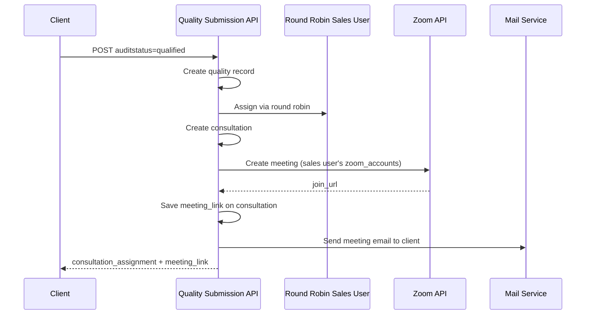

# Quality Data Submission API

## Overview

Single API endpoint for submitting quality audit data with answers. Uses existing tables (`qualities`, `quality_answers`, `quality_questions`, `comments`, `consultations`).

When `auditstatus` is **`qualified`** (typically submitted with `status: "QA-Approved"`), the system automatically:

1. Assigns a **Sales department** user via **round robin** (with load balancing)
2. Creates a **consultation** record for that appointment
3. Generates a **Zoom meeting** using the assigned sales user's matching `zoom_accounts` credentials
4. Saves the meeting link on the **consultation** record (not on `qualities`)
5. Sends a **meeting email** to the client's primary contact email
6. Returns assigned user details and meeting link in `consultation_assignment`

> **Note:** `meetinglink` is no longer accepted in the request. Meeting links are auto-generated via Zoom.

## Base URL

```
/api/quality-data-submission
```

## Authentication & Permissions

All endpoints require:

- JWT authentication: `Authorization: Bearer {token}`
- Permission: `Administration,create`

---

## Prerequisites (QA-Approved / Qualified Flow)

Before submitting a qualified audit, ensure:

| Requirement | Description |
|-------------|-------------|
| Active Sales department | Department named `Sales` with `status = active` |
| Active Sales users | At least one active user assigned to Sales department |
| Zoom account mapping | `zoom_accounts.email` must match the assigned sales user's CRM email |
| Zoom host email | Same `zoom_accounts.email` is used to verify and create meetings in Zoom |
| Zoom S2S OAuth | Valid `account_id`, `client_id`, `client_secret` in `zoom_accounts` |
| Client email | Appointment's business must have a primary contact with valid `primaryemail` (for email notification) |
| Mail config | SMTP/mail settings configured in `.env` for client emails |

See also: [ZOOM_ACCOUNTS_API_DOCUMENTATION.md](./ZOOM_ACCOUNTS_API_DOCUMENTATION.md)

---

## API Endpoints

### 1. Submit Quality Data with Answers (POST)

**Endpoint:** `POST /api/quality-data-submission`

#### Complete Submission (QA-Approved)

```json
{
  "auditstatus": "qualified",
  "status": "QA-Approved",
  "score": 85.50,
  "appointment_id": "FRMID00000001",
  "appointment_current_status": "Conducted",
  "answers": [
    {
      "question_id": 1,
      "answer": "yes"
    },
    {
      "question_id": 3,
      "answer": "yes"
    },
    {
      "question_id": 4,
      "answer": "partially done"
    }
  ],
  "comments": [
    {
      "followup_business_id": 1,
      "comment": "Quality assessment completed successfully. All criteria met.",
      "old_status": "QA-Pending",
      "new_status": "QA-Approved"
    }
  ]
}
```

#### Minimal Submission

```json
{
  "auditstatus": "qualified",
  "status": "In Progress",
  "appointment_id": "FRMID00000001",
  "answers": [
    {
      "question_id": 1,
      "answer": "yes"
    }
  ]
}
```

#### Unqualified Submission (No Sales Assignment)

When `auditstatus` is `unqualified`, no consultation, Zoom meeting, or sales assignment is created.

```json
{
  "auditstatus": "unqualified",
  "status": "QA-Reject",
  "score": 65.25,
  "appointment_id": "FRMID00000001",
  "answers": [
    {
      "question_id": 1,
      "answer": "no"
    },
    {
      "question_id": 3,
      "answer": "partially done"
    }
  ]
}
```

### Validation Rules

| Field | Type | Required | Description |
|-------|------|----------|-------------|
| `auditstatus` | string | Yes | `qualified` or `unqualified` |
| `status` | string | Yes | Quality status (e.g. `QA-Approved`, `QA-Reject`) |
| `score` | number | No | Score between 0 and 100 |
| `appointment_id` | string | Yes | Must exist in `appointments` table |
| `appointment_current_status` | string | No | Updates appointment `current_status` if provided |
| `answers` | array | Yes | Minimum 1 answer required |
| `answers.*.question_id` | integer | Yes | Must exist in `quality_questions` |
| `answers.*.answer` | string | Yes | `yes`, `no`, `partially done`, or `not applicable` |
| `comments` | array | No | Optional status comments |
| `comments.*.followup_business_id` | integer | Yes (when comments sent) | Must exist in `followup_businesses` |
| `comments.*.comment` | string | Yes (when comments sent) | Comment text |
| `comments.*.old_status` | string | Yes (when comments sent) | Previous status |
| `comments.*.new_status` | string | Yes (when comments sent) | New status |

**Allowed `appointment_current_status` values:**

`Booked`, `Confirmed`, `In Progress`, `Conducted`, `Not Conducted`, `Rescheduled`, `Cancelled`, `Scheduled`, `scheduled`, `QA-Pending`, `QA-Approved`, `QA-Hold`, `QA-Reject`, `QA-Rework`

### Qualified Submission Flow



### Success Response (200)

```json
{
  "success": true,
  "message": "Quality data submitted successfully",
  "data": {
    "quality": {
      "id": 1,
      "appointment_id": "FRMID00000001",
      "auditstatus": "qualified",
      "status": "QA-Approved",
      "assigned_user": 1,
      "score": 85.50,
      "created_at": "2026-06-22T12:00:00.000000Z",
      "updated_at": "2026-06-22T12:00:00.000000Z",
      "assignedUser": {
        "id": 1,
        "first_name": "John",
        "last_name": "Doe"
      },
      "appointment": {
        "id": "FRMID00000001",
        "date": "2026-06-20",
        "current_status": "Conducted"
      }
    },
    "answers": [
      {
        "id": 1,
        "quality_id": 1,
        "question_id": 1,
        "answers": "yes",
        "created_at": "2026-06-22T12:00:00.000000Z",
        "updated_at": "2026-06-22T12:00:00.000000Z"
      }
    ],
    "comments": [
      {
        "id": 1,
        "followup_business_id": 1,
        "comment": "Quality assessment completed successfully. All criteria met.",
        "old_status": "QA-Pending",
        "new_status": "QA-Approved",
        "created_by": 1,
        "created_at": "2026-06-22T12:00:00.000000Z",
        "updated_at": "2026-06-22T12:00:00.000000Z"
      }
    ],
    "appointment_updated": true,
    "appointment_current_status": "Conducted",
    "consultation_assignment": {
      "consultation_id": 12,
      "assigned_user_id": 5,
      "assigned_user_name": "Sarah Smith",
      "assigned_user_email": "sarah@company.com",
      "consultation_status": "scheduled",
      "meeting_link": "https://zoom.us/j/12345678901?pwd=abcdef",
      "email_sent": true,
      "client_email": "client@example.com"
    },
    "execution_time_ms": 842.15
  }
}
```

#### `consultation_assignment` fields

| Field | Description |
|-------|-------------|
| `consultation_id` | Newly created consultation ID |
| `assigned_user_id` | Sales user assigned via round robin |
| `assigned_user_name` | Full name of assigned sales user |
| `assigned_user_email` | Email of assigned sales user |
| `consultation_status` | Usually `scheduled` |
| `meeting_link` | Auto-generated Zoom join URL (stored on `consultations`) |
| `email_sent` | `true` if client meeting email was sent successfully |
| `client_email` | Client email address used for notification (nullable if not found) |

> `consultation_assignment` is **`null`** when `auditstatus` is `unqualified`.

---

### 2. Get Active Questions (GET)

**Endpoint:** `GET /api/quality-data-submission/questions`

#### Response (200)

```json
{
  "success": true,
  "message": "Active quality questions retrieved successfully",
  "data": [
    {
      "id": 1,
      "question": "How would you rate our customer service?",
      "is_active": true
    },
    {
      "id": 2,
      "question": "How satisfied are you with our product quality?",
      "is_active": true
    }
  ]
}
```

---

## Database Tables Used

### `qualities` table

| Field | Description |
|-------|-------------|
| `auditstatus` | `qualified` or `unqualified` |
| `status` | Quality record status (e.g. `QA-Approved`) |
| `score` | Overall score (0–100), optional |
| `appointment_id` | FK to `appointments` |
| `assigned_user` | QC user who submitted the audit |

> **`meeting_link` is not stored on `qualities`.** It was moved to `consultations`.

### `consultations` table (created on qualified submission)

| Field | Description |
|-------|-------------|
| `appointment_id` | FK to `appointments` |
| `status` | `scheduled` |
| `assigned_user` | Sales user (round robin) |
| `meeting_date` | From appointment date |
| `meeting_slot` | From appointment time slot |
| `meeting_link` | Auto-generated Zoom join URL |

### `appointments` table (optional update)

| Field | Description |
|-------|-------------|
| `current_status` | Updated when `appointment_current_status` is sent |

### `quality_answers` table

| Field | Description |
|-------|-------------|
| `quality_id` | Auto-linked to the quality record created in this request |
| `question_id` | FK to `quality_questions` |
| `answers` | `yes`, `no`, `partially done`, or `not applicable` |

### `comments` table (optional)

| Field | Description |
|-------|-------------|
| `followup_business_id` | FK to `followup_businesses` |
| `comment` | Comment text |
| `old_status` / `new_status` | Status change tracking |
| `created_by` | Submitting user |

### `emails` table (on successful client notification)

A record is created with `type: consultation_meeting` when the client meeting email is sent.

---

## cURL Examples

### Submit QA-Approved Quality Data

```bash
curl -X POST http://127.0.0.1:8000/api/quality-data-submission \
  -H "Content-Type: application/json" \
  -H "Authorization: Bearer YOUR_JWT_TOKEN" \
  -d '{
    "auditstatus": "qualified",
    "status": "QA-Approved",
    "score": 85.50,
    "appointment_id": "FRMID00000001",
    "appointment_current_status": "Conducted",
    "answers": [
      { "question_id": 1, "answer": "yes" },
      { "question_id": 3, "answer": "yes" }
    ],
    "comments": [
      {
        "followup_business_id": 1,
        "comment": "Quality assessment completed",
        "old_status": "QA-Pending",
        "new_status": "QA-Approved"
      }
    ]
  }'
```

### Get Active Questions

```bash
curl -X GET http://127.0.0.1:8000/api/quality-data-submission/questions \
  -H "Authorization: Bearer YOUR_JWT_TOKEN"
```

---

## JavaScript / Axios Example

```javascript
const submitQualityData = async () => {
  const response = await axios.post('/api/quality-data-submission', {
    auditstatus: 'qualified',
    status: 'QA-Approved',
    score: 85.50,
    appointment_id: 'FRMID00000001',
    appointment_current_status: 'Conducted',
    answers: [
      { question_id: 1, answer: 'yes' },
      { question_id: 3, answer: 'yes' },
    ],
    comments: [
      {
        followup_business_id: 1,
        comment: 'Quality assessment completed',
        old_status: 'QA-Pending',
        new_status: 'QA-Approved',
      },
    ],
  }, {
    headers: {
      Authorization: `Bearer ${token}`,
      'Content-Type': 'application/json',
    },
  });

  const assignment = response.data.data.consultation_assignment;

  if (assignment) {
    console.log('Assigned to:', assignment.assigned_user_name);
    console.log('Meeting link:', assignment.meeting_link);
    console.log('Email sent:', assignment.email_sent);
  }

  return response.data;
};
```

---

## Error Responses

### Validation Error (422)

```json
{
  "success": false,
  "message": "Validation failed",
  "errors": {
    "auditstatus": ["The auditstatus field is required."],
    "answers": ["The answers field is required."]
  }
}
```

### Submission Failed — No Sales Users (500)

Entire transaction is rolled back (quality record is not saved).

```json
{
  "success": false,
  "message": "An error occurred while processing your request: Failed to assign consultation to Sales user - no active Sales users available",
  "errors": {
    "error_code": "QUALITY_SUBMISSION_FAILED"
  }
}
```

### Submission Failed — Zoom Account Missing (500)

Occurs when assigned sales user has no matching row in `zoom_accounts`.

```json
{
  "success": false,
  "message": "An error occurred while processing your request: No Zoom account found for assigned sales user: sales@company.com",
  "errors": {
    "error_code": "QUALITY_SUBMISSION_FAILED"
  }
}
```

### Submission Failed — Zoom API Error (500)

```json
{
  "success": false,
  "message": "An error occurred while processing your request: Failed to create Zoom meeting: Invalid access token.",
  "errors": {
    "error_code": "QUALITY_SUBMISSION_FAILED"
  }
}
```

> If Zoom meeting is created but email fails, submission still succeeds with `email_sent: false` in `consultation_assignment`.

---

## Testing Checklist

### Qualified (QA-Approved) flow
- [ ] Submit with `auditstatus: qualified` and `status: QA-Approved`
- [ ] Verify `consultation_assignment` is returned
- [ ] Verify assigned user is from Sales department (round robin)
- [ ] Verify `meeting_link` is a valid Zoom URL
- [ ] Verify `meeting_link` saved on `consultations` table (not `qualities`)
- [ ] Verify client receives meeting email (if mail configured)
- [ ] Verify `email_sent: true` when email succeeds

### Unqualified flow
- [ ] Submit with `auditstatus: unqualified`
- [ ] Verify `consultation_assignment` is `null`
- [ ] Verify no consultation or Zoom meeting is created

### Failure cases
- [ ] No active Sales users → submission fails, nothing saved
- [ ] Sales user without `zoom_accounts` mapping → submission fails
- [ ] Invalid Zoom credentials → submission fails
- [ ] Missing client email → submission succeeds, `email_sent: false`

### Prerequisites
- [ ] Sales department exists and is active
- [ ] Sales users assigned to department
- [ ] `zoom_accounts.email` matches each sales user's CRM email
- [ ] Mail SMTP configured in `.env`

---

## Features Summary

- Single API endpoint for complete quality audit submission
- Automatic Sales assignment via round robin + load balancing on `auditstatus: qualified`
- Auto Zoom meeting creation using assigned sales user's `zoom_accounts` credentials
- Client meeting email sent to primary business contact
- Meeting link stored on `consultations.meeting_link` (removed from `qualities`)
- Response includes assigned user, meeting link, and email status
- Transaction safety — failure rolls back quality, consultation, and answers
- Optional appointment status update and comments support
